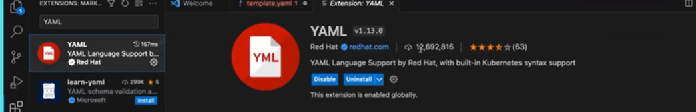
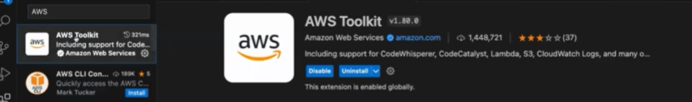

# cloud_formation_template

## 2 main plugins used to write the CFT easy in Declarative format in the VSCODE
1. yaml extension plugin  
2. AWS toolkit plugin   

## CFT vs Terraform
Terraform is used basically on a multi cloud environment (using the AWS or Azure or Hybrid) at the same time

